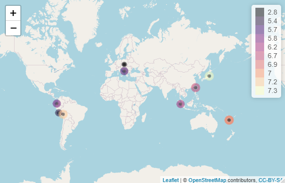

<!-- README.md is generated from README.Rmd. Please edit that file -->

```{r, include = FALSE}
knitr::opts_chunk$set(
  collapse = TRUE,
  comment = "#>",
  fig.path = "man/figures/README-",
  out.width = "100%"
)
```

# earthquake

<!-- badges: start -->
[](https://github.com/haliyan/earthquake/actions)
<!-- badges: end -->

The goal of earthquake is to clean, map, and visualize raw NOAA (National Oceanic and Atmospheric Administration) earthquake data. This package was created as part of the Coursera specialization "Mastering Software Development in R" by JHU. 

## IMPORTANT NOTES FOR PEER REVIEWERS 

**PLEASE READ (2 NOTES BELOW)**

**NOTE 1**

**This package has a R-CMD-Check badge provided by GitHub Actions and NOT a Travis badge.** 

**This means it also includes a R-CMD-check.yaml file inside the .github foler instead of a .travis.yml file.**

Since the time of the creation of this course, Travis CI has changed significantly. It is no longer as straightforward as outlined in the course materials to use Travis for open-source projects. My understanding is that using their services for open-source projects such as this one requires signing up for a plan/trial (which in turn requires disclosing credit card information to Travis, which I wish to avoid if at all possible) and applying for open source credits. 
See Travis's statements on open source credits [here](https://docs.travis-ci.com/user/billing-faq/#what-if-i-am-building-open-source) and trial plan [here](https://docs.travis-ci.com/user/billing-overview/#free-trial-plan). 

**Due to these issues, I have used GitHub Actions instead of Travis to check my package.**

You can verify that the log contains NO errors, warnings, or notes by clicking on the badge at the top of the README, then selecting the top (=most recent) workflow run which should have a blue check mark beside it. For details, click the gray "R-CMD-Check" button then select one of the drop downs in the menu (the most useful will probably be "Run r-lib/actions/check-r-package@v1").

**NOTE 2**

**The data used in this package is NOT accessed through the link in the MSDR Capstone Course.**

The reason for this is that the link provided has since **expired**. 
Clicking on it only produces [this page](https://www.ngdc.noaa.gov/nndc/struts/form?t=101650&s=1&d=1). 
This issue was raised in the course discussion forums two years ago, but the link has not been fixed. 
I used the dataset which I believed was closest to the dataset intended for use by the course creators. 

**I ask that you please be considerate of both of these issues when grading my work!**
I have worked very hard on this project (as you likely have also) and do not want to fail due to reasons beyond my control. 


## Installation

You can install the development version of earthquake like so: 
Enter `install_github("haliyan/earthquake")` into the console. 

*Note: using the `install_github()` function requires that the `devtools` package be installed and loaded. `devtools` can be
installed using `install_packages("devtools")` and loaded using 
`library(devtools)`.* 

Once the `earthquake` package is installed, load it using the code
`library(earthquake)`. 

```{r,echo=FALSE}
library(earthquake)
library(knitr)
```

## Data 
The NOAA data were sourced from [this web page](https://data.noaa.gov/metaview/page?xml=NOAA/NESDIS/NGDC/MGG/Hazards/iso/xml/G012153.xml&view=getDataView).

Download the most recent version of the data by selecting "NCEI/WDS Global Significant Earthquake Database", then scrolling down and clicking "Search". Then click the download button in the top left hand corner of the page. 

Once the data has been downloaded, read it into R using `readr::read_delim()` as follows: 

```{r, eval=FALSE}
data_name<-readr::read_delim("download_name.tsv",delim="\t")
```

Substitute "data_name" with the desired name for the data.frame in R (e.g. earthquake_data) and "download_name" with the name of the downloaded file. 

Note that a version of the NOAA earthquake dataset is provided in this package for examples and testing purposes. 
**This is NOT the most up-to-date version of the data set and should NOT be used for analysis. It is recommended that the user download the most recent version of the earthquake data and load it into R as shown above.** 
The version included in the package for examples or practice is called `eq` and is available for use upon installing and loading the package.


## Examples

Data can be cleaned using the `eq_raw_cleaner` function. 
```{r}
eq_clean<-eq_raw_cleaner(eq)
```

Once cleaned, the data can be plotted as part of a ggplot object using the timeline geom.  
The following code also demonstrates the `bc_date()` and `year_pad()` functions in action. 

```{r}
ggplot2::ggplot(data=eq_clean, 
                ggplot2::aes(x=Date,
                             xmin=bc_date(y="-033"),
                             xmax=year_pad(y="11"),
                             colour=Latitude,
                             fill=Latitude)) +
  geom_timeline(size=5) +
  ggplot2::ggtitle("Earthquakes from 33BC to 11AD")
```

Another example of the timeline geom shows how the y-aesthetic can be used. 

```{r}
ggplot2::ggplot(data=eq_clean, 
                ggplot2::aes(x=Date, 
                             xmin=as.Date("2022-02-25"),
                             xmax=as.Date("2022-03-22"),
                             y=Mag,
                             col=`Total Injuries`,
                             fill=`Total Injuries`)) +
                  geom_timeline(size=5) +
  ggplot2::ggtitle("Selection of 2022 Earthquakes by Magnitude")
```

The earthquake data can also be plotted with the timeline label geom. The following plot shows some earthquakes that occurred in early 2022 with the 2 largest (by magnitude) earthquakes' countries labeled. 

```{r}
ggplot2::ggplot(data=eq_clean,
                ggplot2::aes(x=Date,
                             xmin=as.Date("2022-01-07"),
                             xmax=as.Date("2022-03-27"),
                             max_by=Mag,
                             txt=Country,
                             n_max=3,
                             col=Mag,
                             fill=Mag)) +
  geom_timeline_label() +
  ggplot2::ggtitle("Early 2022 Earthquakes")
```

Finally, the data can be mapped in Leaflet with the `eq_map` function.

The `eq_create_label()` function can be used to create popup text (which contains information about earthquake location, magnitude, and number of deaths caused) for each point displayed on the map. 
The image included is a screenshot of the map generated from the code below:

```{r,eval=FALSE}
eq_popup_data<-dplyr::mutate(tail(eq_clean,10), text=eq_create_label(tail(eq_clean,10)))
eq_map(eq_popup_data, 
       color= eq_popup_data$Mag, 
       annot_col=eq_popup_data$text)
```



When the code is run in R, a fully interactive Leaflet map (with popups) will be created. 

## License 

GPL
