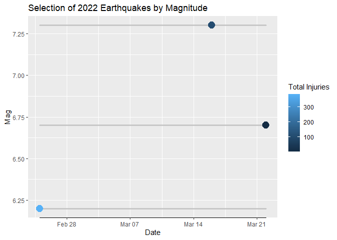
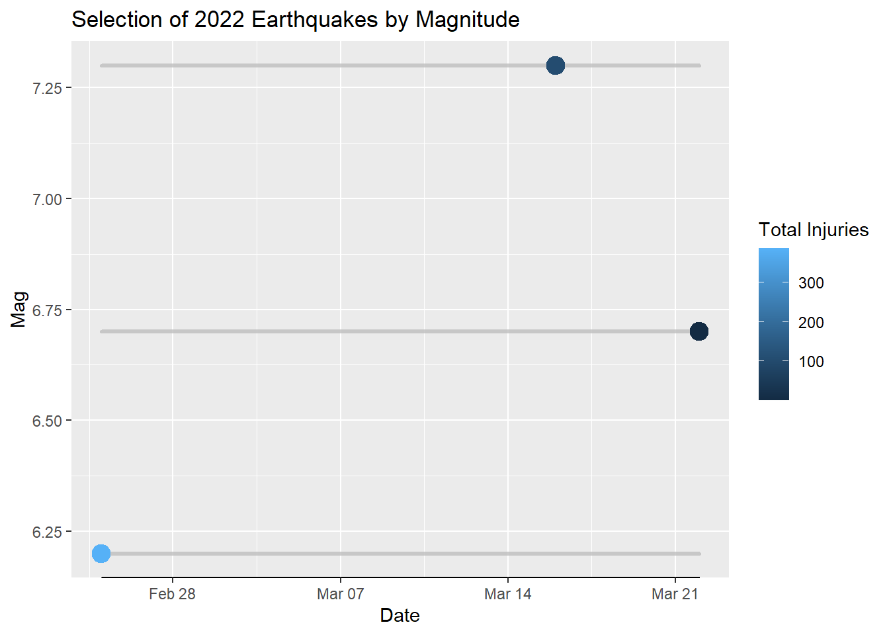
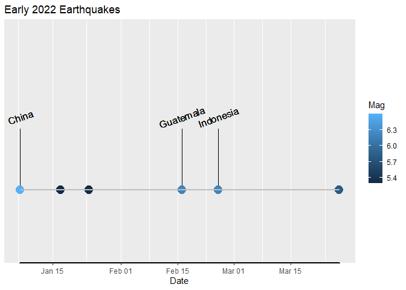

<!-- README.md is generated from README.Rmd. Please edit that file -->

# earthquake

<!-- badges: start -->
<!-- badges: end -->

The goal of earthquake is to clean, map, and visualize raw NOAA
earthquake data.

## Installation

You can install the development version of earthquake like so: Enter
`install_github("haliyan/earthquake")` into the console.

*Note: using the function requires that the package be installed and
loaded. can be installed using and loaded using .*

Once the package is installed, load it using the code .

## Data

The NOAA data were sourced from [this web
page](www.ngdc.noaa.gov/hazel/view/hazards/earthquake/event-data)
Download the most recent version of the data by clicking the download
button in the top left hand corner of the page. Once the data has been
downloaded, read it into R using as follows:

``` r
data_name<-readr::read_delim("download_name.tsv",delim="\t")
```

Substitute “data\_name” with the desired name for the data.frame in R
(e.g. earthquake\_data) and “download\_name” with the name of the
downloaded file.

Note that a version of the NOAA earthquake dataset is provided in this
package for examples and testing purposes. **This is NOT the most
up-to-date version of the data set and should NOT be used for analysis.
It is recommended that the user download the most recent version of the
earthquake data and load it into R as shown above.** To access the
version included in the package for examples or practice, use the
following code:

``` r
data(eq_data)
```

The object `eq_data` will now be saved into the environment and can be
cleaned and visualized.

## Examples

Data can be cleaned using the `eq_raw_cleaner` function.

``` r
eq_clean<-eq_raw_cleaner(eq_data)
```

Once cleaned, the data can be plotted as part of a ggplot object using
the timeline geom.  
The following code also demonstrates the and functions in action.

``` r
ggplot2::ggplot(data=eq_clean, 
                ggplot2::aes(x=Date,
                             xmin=bc_date(y="-033"),
                             xmax=year_pad(y="11"),
                             colour=Latitude,
                             fill=Latitude)) +
  geom_timeline(size=5) +
  ggplot2::ggtitle("Earthquakes from 33BC to 11AD")
```



Another example of the timeline geom shows how the y-aesthetic can be
used.

``` r
ggplot2::ggplot(data=eq_clean, 
                ggplot2::aes(x=Date, 
                             xmin=as.Date("2022-02-25"),
                             xmax=as.Date("2022-03-22"),
                             y=Mag,
                             col=`Total Injuries`,
                             fill=`Total Injuries`)) +
                  geom_timeline(size=5) +
  ggplot2::ggtitle("Selection of 2022 Earthquakes by Magnitude")
```



The earthquake data can also be plotted with the timeline label geom.
The following plot shows some earthquakes that occurred in early 2022
with the 2 largest (by magnitude) earthquakes’ countries labeled.

``` r
ggplot2::ggplot(data=eq_clean,
                ggplot2::aes(x=Date,
                             xmin=as.Date("2022-01-07"),
                             xmax=as.Date("2022-03-27"),
                             max_by=Mag,
                             txt=Country,
                             n_max=3,
                             col=Mag,
                             fill=Mag)) +
  geom_timeline_label() +
  ggplot2::ggtitle("Early 2022 Earthquakes")
```



Finally, the data can be mapped in Leaflet with the function.

The function can be used to create popup text (which contains
information about earthquake location, magnitude, and number of deaths
caused) for each point displayed on the map.

``` r
eq_popup_data<-dplyr::mutate(tail(eq_clean,10), text=eq_create_label(tail(eq_clean,10)))
eq_map(eq_popup_data, 
       color= eq_popup_data$Mag, 
       annot_col=eq_popup_data$text)
```

<div id="htmlwidget-2899952846d9ba9987bb" style="width:100%;height:480px;" class="leaflet html-widget"></div>
<script type="application/json" data-for="htmlwidget-2899952846d9ba9987bb">{"x":{"options":{"crs":{"crsClass":"L.CRS.EPSG3857","code":null,"proj4def":null,"projectedBounds":null,"options":{}}},"calls":[{"method":"addTiles","args":["https://{s}.tile.openstreetmap.org/{z}/{x}/{y}.png",null,null,{"minZoom":0,"maxZoom":18,"tileSize":256,"subdomains":"abc","errorTileUrl":"","tms":false,"noWrap":false,"zoomOffset":0,"zoomReverse":false,"opacity":1,"zIndex":1,"detectRetina":false,"attribution":"&copy; <a href=\"https://openstreetmap.org\">OpenStreetMap<\/a> contributors, <a href=\"https://creativecommons.org/licenses/by-sa/2.0/\">CC-BY-SA<\/a>"}]},{"method":"addCircleMarkers","args":[[0.233,37.702,23.412,0.909,-22.716,-22.579,43.061,50.04,-12.36,-14.863],[100.106,141.587,121.562,-79.589,170.286,170.354,18.176,18.59,-76.89,-70.308],0.01,null,null,{"interactive":true,"className":"","stroke":true,"color":"black","weight":5,"opacity":0.5,"fill":true,"fillColor":"black","fillOpacity":0.2},null,null,null,null,null,{"interactive":false,"permanent":false,"direction":"auto","opacity":1,"offset":[0,0],"textsize":"10px","textOnly":false,"className":"","sticky":true},null]},{"method":"addCircleMarkers","args":[[0.233,37.702,23.412,0.909,-22.716,-22.579,43.061,50.04,-12.36,-14.863],[100.106,141.587,121.562,-79.589,170.286,170.354,18.176,18.59,-76.89,-70.308],[6.2,7.3,6.7,5.8,6.9,7,5.7,2.8,5.4,7.2],null,null,{"interactive":true,"className":"","stroke":true,"color":["#A12D7A","#FCFDBF","#C64A75","#761C7B","#E56E6B","#FD966B","#48136E","#000004","#281139","#FFCA94"],"weight":5,"opacity":0.5,"fill":true,"fillColor":["#A12D7A","#FCFDBF","#C64A75","#761C7B","#E56E6B","#FD966B","#48136E","#000004","#281139","#FFCA94"],"fillOpacity":0.2},null,null,["<b>Location Name:<\/b> W Sumatra: Pasaman, West Pasaman <br> <b>Magnitude:<\/b> 6.2 <br> <b>Total Deaths:<\/b> 11 <br>","<b>Location Name:<\/b> Off Fukushima <br> <b>Magnitude:<\/b> 7.3 <br> <b>Total Deaths:<\/b> 4 <br>","<b>Location Name:<\/b> Hualien, T'ait-Tung <br> <b>Magnitude:<\/b> 6.7 <br> ","<b>Location Name:<\/b> Esmeraldas <br> <b>Magnitude:<\/b> 5.8 <br> ","<b>Location Name:<\/b> Loyalty Islands <br> <b>Magnitude:<\/b> 6.9 <br> ","<b>Location Name:<\/b> Loyalty Islands <br> <b>Magnitude:<\/b> 7 <br> ","<b>Location Name:<\/b> Bosnia-Herzegovina: Mostar, Stolac <br> <b>Magnitude:<\/b> 5.7 <br> <b>Total Deaths:<\/b> 1 <br>","<b>Location Name:<\/b> Silesian:  Jastrzebie-Zdroj <br> <b>Magnitude:<\/b> 2.8 <br> <b>Total Deaths:<\/b> 10 <br>","<b>Location Name:<\/b> Lima, Callao, Chilca <br> <b>Magnitude:<\/b> 5.4 <br> <b>Total Deaths:<\/b> 2 <br>","<b>Location Name:<\/b> Puno <br> <b>Magnitude:<\/b> 7.2 <br> "],null,null,{"interactive":false,"permanent":false,"direction":"auto","opacity":1,"offset":[0,0],"textsize":"10px","textOnly":false,"className":"","sticky":true},null]},{"method":"addLegend","args":[{"colors":["#000004","#281139","#48136E","#761C7B","#A12D7A","#C64A75","#E56E6B","#FD966B","#FFCA94","#FCFDBF"],"labels":["2.8","5.4","5.7","5.8","6.2","6.7","6.9","7","7.2","7.3"],"na_color":null,"na_label":"NA","opacity":0.5,"position":"topright","type":"factor","title":null,"extra":null,"layerId":null,"className":"info legend","group":null}]}],"limits":{"lat":[-22.716,50.04],"lng":[-79.589,170.354]}},"evals":[],"jsHooks":[]}</script>

\#\#License GPL
